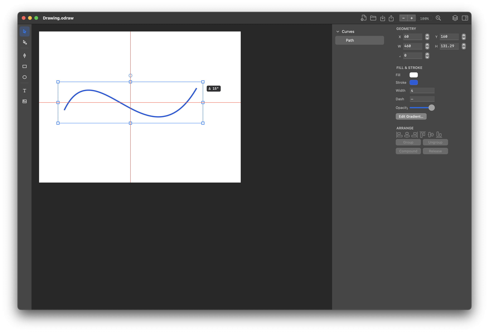

# OpenDraw

A native vector graphics editor for macOS, built in Swift for Apple Silicon.

> **Status: early development.** The architecture, document model, and
> verification infrastructure are complete and audited; the Phase 5 core and
> native editor interface are delivered, while distribution and the PDF
> capability decision remain. If you're here expecting an
> Illustrator replacement today, come back later. If you're here for a
> rigorously verified vector graphics core, read on.

## Current state



This is the accepted dark-mode U3-B editor shell: tool rail, native toolbar,
layers, Inspector, selection chrome, guides, and in-place editing. The image is
the owner-approved closure artifact, not a concept mockup.

## What it is

OpenDraw is a from-scratch, clean-room vector editor. No inherited codebases,
no dependency takeovers. The current build supports:

- Bézier paths (pen tool with smooth/corner anchors, mirrored handles,
  open and closed paths)
- Rectangles, ellipses, and text objects
- Direct selection: anchor and direction-handle editing with document-space
  transform composition
- Grouping, ungrouping, and compound paths (make/release)
- Layers with lock/hide, precise hit testing, and a spatial index
- Delta / command-inverse history with count and byte budgets, undo/redo, and
  checkpoint-backed memory safety
- A tile-composite production renderer with damage-mapped invalidation and an
  exact-budget LRU cache
- A native AppKit editor shell with tool rail, toolbar, Layers, Inspector,
  alignment controls, modifier gestures, and in-place text editing
- Raster image placement with strict resource limits and an approved-image
  rendering pipeline
- Native JSON document format with atomic, durable saves, autosave, and
  rolling backups
- SVG import with hardened parser limits; SVG export
- Angle and axis snapping with pinned, verified tie-breaking rules

## Requirements

- macOS 15.0 (Sequoia) or later
- Apple Silicon

Both constraints are deliberate (recorded architecture decisions ADR-1/ADR-011):
one platform, one architecture, no legacy surface.

## Building

```sh
git clone https://github.com/leetn9468/OpenDraw.git
cd OpenDraw
scripts/build-release-app.sh
open dist/OpenDraw.app
```

Tests: `swift test`. The full local gate battery (sanitizers, coverage,
benchmarks, memory ceilings, reliability loops) lives in `scripts/`.

## How this project is built — and verified

OpenDraw is developed by AI coding agents under human architectural direction,
with an unusual constraint: **nothing ships on self-reported results.** Every
piece of production math goes through a pre-authored verification queue
(worked examples pinned before implementation, including degenerate cases,
with two independent AI reviewers required to agree), and an independent
cross-verification layer recomputes all numeric claims rather than trusting
them.

The pre-release audit ran under a zero-deferral policy — every finding of
every severity fixed, no accepted-risk register, no conditional passes — and
closed through 12 hard blockers with committed, reproducible evidence:

- 146 tests green across debug, release, and AddressSanitizer configurations
- 34 frozen verification entries (VERIFY-001–034) covering transforms, Bézier
  evaluation, bounds, fill rules, snapping, history, tile caching, and
  alignment math
- Deterministic adversarial corpus (512 mutations, pinned seed) against the
  JSON and SVG parsers
- Golden-image rendering suite with explicit tolerances
- Enforced CI gates for peak memory, startup p95, benchmark absolute targets,
  and crash-free reliability (100 clean process launches, 10,000 native
  round trips)
- Runtime proof on real minimum-OS hardware, not just deployment-target
  compilation

The full audit trail — anchors, blockers, owner decisions, and the evidence
map — is in `docs/PROJECT_STATE.md` and `artifacts/r4/`. The audited baseline
is tagged `pre-phase5-remediation`.

Hosted CI runs on GitHub's `macos-15` runners. Stable-reference timing gates
remain blocking; the recorded hosted exceptions for BENCH-5b and BENCH-6
timing are informational while their correctness assertions remain blocking.
Ratio-based regression detection is blocking on reference hardware and
informational on shared runners; comparison data is still published with every
run.

## Roadmap (Phase 5)

- Delivered: delta / command-inverse history (P1–P4)
- Delivered: tile render caching and production compositing (T1–T3)
- Delivered: native UI redesign (U3-A/U3-B)
- Remaining: notarized distribution
- Remaining: PDF import/export capability decision

## License

License to be determined. Until a LICENSE file is present, all rights
reserved; the source is public for transparency and review.
